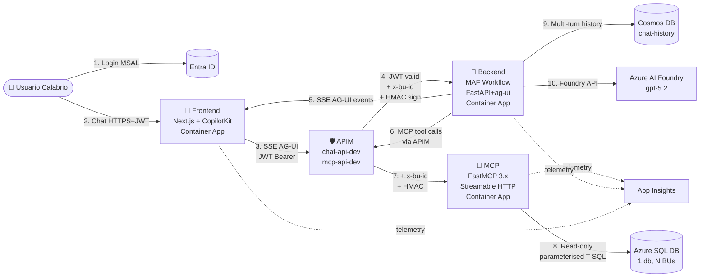
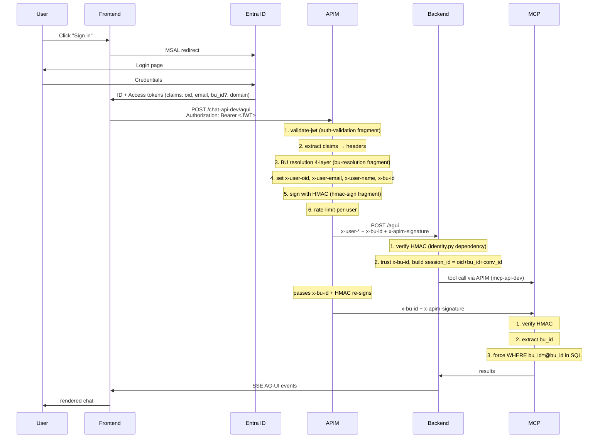

# PLAN — ParalelCalabrioMAF v2

> **Single source of truth** del proyecto. Toda decisión arquitectónica vive aquí.
> Si algo de este documento entra en conflicto con código, gana este documento — y abrimos un issue.

**Fecha de creación**: 2026-05-27
**Estado**: Phase 0 — Scaffold
**Branch base de trabajo**: `develop` (PRs → `main`)

---

## Tabla de contenidos

1. [Visión y alcance](#1-visión-y-alcance)
2. [Arquitectura global](#2-arquitectura-global)
3. [Decisiones arquitectónicas locked](#3-decisiones-arquitectónicas-locked)
4. [Stack tecnológico](#4-stack-tecnológico)
5. [Estructura del monorepo](#5-estructura-del-monorepo)
6. [Componentes en detalle](#6-componentes-en-detalle)
7. [Flujo de autenticación y BU resolution](#7-flujo-de-autenticación-y-bu-resolution)
8. [Diseño del MCP](#8-diseño-del-mcp)
9. [Estrategia de schema (DB ↔ LLM)](#9-estrategia-de-schema-db--llm)
10. [Infraestructura Azure](#10-infraestructura-azure)
11. [Testing](#11-testing)
12. [DevOps y branching](#12-devops-y-branching)
13. [Fases del proyecto](#13-fases-del-proyecto)
14. [Inventario de variables de entorno](#14-inventario-de-variables-de-entorno)
15. [Referencias y artefactos legacy](#15-referencias-y-artefactos-legacy)

---

## 1. Visión y alcance

### Objetivo del producto

Asistente conversacional para que usuarios de Calabrio WFM hagan preguntas en lenguaje natural sobre sus datos (turnos, absentismo, agentes, sites, etc.), y reciban respuestas con datos reales de su Business Unit (BU) — todo sin exponer ni SQL al usuario ni datos de otras BUs.

### Alcance v2 (este proyecto)

- **3 Azure Container Apps**: backend (orquestación MAF), frontend (Next.js + CopilotKit), MCP (FastMCP).
- **Frontend con login Entra ID** + chat en tiempo real (AG-UI).
- **APIM por delante** de backend y MCP con auth, rate limiting, BU resolution, HMAC sign.
- **1 BU activa** (`CWFM-DEMO`, BU_ID=1), arquitectura preparada para N BUs.
- **Multi-turno persistente** vía Cosmos DB.
- **Observabilidad** end-to-end con Azure Monitor + App Insights.

### Fuera de alcance v2

- Acciones de escritura sobre WFM (solo read-only).
- Multi-tenant físico (un único Azure SQL Database, segregación lógica por `bu_id`).
- Auto-aprovisionamiento de nuevos clientes.
- Integraciones externas (Teams, Slack, etc.) — futuro.

---

## 2. Arquitectura global



### Principios de diseño

1. **Cada servicio tiene una sola responsabilidad** (frontend = UI/auth, backend = orquestación LLM, MCP = acceso DB).
2. **APIM siempre delante** — nada se expone directamente.
3. **HMAC entre APIM y backend/MCP** — para que backend y MCP confíen únicamente en peticiones firmadas por APIM (defensa en profundidad si alguien expusiera accidentalmente el endpoint del CA).
4. **BU se resuelve en APIM**, no en backend. Backend confía en el header `x-bu-id`.
5. **MCP es stateless** — no guarda estado de conversación.
6. **Multi-turno vive en backend** vía `CosmosHistoryProvider` con `session_id` por usuario+BU+conv.

---

## 3. Decisiones arquitectónicas locked

| #  | Decisión | Justificación |
|----|----------|---------------|
| D1 | Monorepo (apps/backend, apps/frontend, apps/mcp) | Refactor cruzado y revisión atómica; 1 PR puede tocar contrato BE↔MCP. |
| D2 | 3 Container Apps independientes (no monolito) | Escalado independiente; FE puede crecer en concurrencia sin afectar al MCP. |
| D3 | Frontend Next.js 15 + CopilotKit + Tailwind/shadcn/ui + MSAL (`@azure/msal-react`) | CopilotKit + MAF AG-UI = integración nativa; MSAL redirect flow para Entra ID. |
| D4 | Backend FastAPI + `agent_framework.ag_ui` (1st party) | Endpoint AG-UI oficial vía `add_agent_framework_fastapi_endpoint`. |
| D5 | MCP con FastMCP ≥3.3.1 + `mount(prefix=...)` para namespacing | Stateless Streamable HTTP; namespaces (`schema.*`, `query.*`, futuro `forecast.*`) sin colisiones. |
| D6 | APIM con multi-API por entorno (`chat-api-dev`, `chat-api-prod`, `mcp-api-dev`, `mcp-api-prod`) | Aislamiento estricto dev/prod; policies versionadas en repo como fragments. |
| D7 | Policy Fragments reutilizables (`auth-validation`, `bu-resolution`, `hmac-sign`, `rate-limit-per-user`) | DRY entre APIs; 1 sitio para cambiar lógica de auth/BU. |
| D8 | BU resolution 4-layer en APIM: (1) JWT claim → (2) domain map (Named Value) → (3) `x-debug-bu` header POC → (4) `BU_ID_DEFAULT` fallback | Funciona desde día 1 sin claim configurado; soporta multi-BU sin código. |
| D9 | Schema introspection: INFORMATION_SCHEMA + `sys.extended_properties` (MS_Description) — **sin aliases** | Single source of truth dentro de SQL; partner aprueba `sp_addextendedproperty`; LLM lee desde MCP en runtime. |
| D10 | Intent simplificado: kill `candidate_tables` — Intent solo clasifica (DataQuery / Conversational / OutOfScope); SqlBuilder explora schema solo (vía MCP) | Reduce acoplamiento y tokens; cada step hace 1 cosa. |

---

## 4. Stack tecnológico

### Backend (`apps/backend`)
- Python 3.11
- `agent-framework==1.6.0` (meta) — usa `agent_framework`, `agent_framework.ag_ui`, `agent_framework.foundry`, `agent_framework.azure`
- FastAPI + Uvicorn
- `azure-cosmos`, `azure-identity`, `azure-monitor-opentelemetry`
- `mcp` (cliente, vía `MCPStreamableHTTPTool` de MAF)
- pytest, pytest-asyncio, httpx

### Frontend (`apps/frontend`)
- Node 20, pnpm
- Next.js 15 (App Router, RSC)
- React 19
- `@copilotkit/react-core`, `@copilotkit/react-ui`, `@copilotkit/runtime`
- `@azure/msal-browser`, `@azure/msal-react`
- Tailwind CSS 4 + shadcn/ui
- Vitest, Playwright

### MCP (`apps/mcp`)
- Python 3.11
- `fastmcp>=3.3.1`
- `pyodbc` o `aioodbc` (driver SQL Server)
- `sqlglot` (validación AST de SELECT-only)
- `azure-identity` (DefaultAzureCredential para Entra-auth SQL)
- `azure-keyvault-secrets` (si SQL auth con contraseña)
- pytest, pytest-asyncio

### Infra (`infra/`)
- Bicep (módulos: `containerapps.bicep`, `apim.bicep`, `cosmos.bicep`, `keyvault.bicep`, `acr.bicep`, `loganalytics.bicep`, `appinsights.bicep`, `sql.bicep`, `network.bicep`)
- `azd` (Azure Developer CLI) para deploys
- Container Apps Environment compartido
- APIM developer SKU (Standard v2 si presupuesto)

### CI/CD (`.github/workflows/`)
- GitHub Actions
- Workflows separados por componente: `backend-ci.yml`, `frontend-ci.yml`, `mcp-ci.yml`, `infra-validate.yml`
- Workflow E2E: `e2e-tests.yml` (sobre branch `develop` post-merge)

---

## 5. Estructura del monorepo

```
ParalelCalabrioMAFTest/
├── PLAN.md                          # ← este documento
├── README.md                        # quickstart consolidado, links a docs/
├── .env.example                     # vars de infra (azd)
├── .github/
│   ├── ISSUE_TEMPLATE/
│   │   ├── bug_report.md
│   │   ├── feature.md
│   │   ├── docs.md
│   │   ├── infra.md
│   │   ├── security.md
│   │   ├── test.md
│   │   ├── refactor.md
│   │   ├── chore.md
│   │   └── config.yml
│   ├── pull_request_template.md
│   ├── CODEOWNERS
│   └── workflows/
│       ├── backend-ci.yml
│       ├── frontend-ci.yml
│       ├── mcp-ci.yml
│       ├── infra-validate.yml
│       └── e2e-tests.yml
├── apps/
│   ├── backend/
│   │   ├── app/
│   │   │   ├── __init__.py
│   │   │   ├── main.py              # FastAPI app + ag-ui endpoint
│   │   │   ├── workflow.py          # 3-step MAF workflow (Intent→SQLBuilder→QueryExecutor)
│   │   │   ├── identity.py          # FastAPI dependency: parse x-user-* + x-bu-id + verify HMAC
│   │   │   ├── history.py           # CosmosHistoryProvider wrapper
│   │   │   ├── tools.py             # MCPStreamableHTTPTool factory
│   │   │   └── settings.py          # pydantic-settings
│   │   ├── tests/
│   │   ├── pyproject.toml
│   │   ├── Dockerfile
│   │   ├── .env.example
│   │   └── README.md
│   ├── frontend/
│   │   ├── app/                     # Next.js App Router
│   │   │   ├── layout.tsx
│   │   │   ├── page.tsx             # landing/login
│   │   │   ├── chat/page.tsx
│   │   │   └── api/copilotkit/route.ts
│   │   ├── components/
│   │   │   ├── chat/
│   │   │   ├── auth/MsalProvider.tsx
│   │   │   └── ui/                  # shadcn
│   │   ├── lib/
│   │   │   ├── msal-config.ts
│   │   │   └── api-client.ts
│   │   ├── tests/                   # vitest unit
│   │   ├── e2e/                     # playwright
│   │   ├── package.json
│   │   ├── Dockerfile
│   │   ├── .env.local.example
│   │   └── README.md
│   └── mcp/
│       ├── app/
│       │   ├── __init__.py
│       │   ├── server.py            # FastMCP entry + mounts
│       │   ├── schema_tools.py      # schema.list / search / describe / get_distinct_values
│       │   ├── query_tools.py       # query.execute (read-only)
│       │   ├── sql_client.py        # SqlDatabaseClient
│       │   ├── validator.py         # sqlglot AST validator
│       │   ├── identity.py          # verify HMAC + parse x-bu-id
│       │   └── settings.py
│       ├── scripts/
│       │   ├── bootstrap_metadata.py  # crear _metadata schema + tablas
│       │   └── seed_extended_properties.py
│       ├── tests/
│       ├── pyproject.toml
│       ├── Dockerfile
│       ├── .env.example
│       └── README.md
├── infra/
│   ├── main.bicep
│   ├── main.parameters.json
│   ├── modules/
│   │   ├── containerapps.bicep
│   │   ├── apim.bicep
│   │   ├── cosmos.bicep
│   │   ├── keyvault.bicep
│   │   ├── acr.bicep
│   │   ├── loganalytics.bicep
│   │   ├── appinsights.bicep
│   │   ├── sql.bicep
│   │   └── network.bicep
│   └── apim-policies/
│       ├── fragments/
│       │   ├── auth-validation.xml
│       │   ├── bu-resolution.xml
│       │   ├── hmac-sign.xml
│       │   └── rate-limit-per-user.xml
│       └── apis/
│           ├── chat-api.xml
│           └── mcp-api.xml
├── database/
│   ├── 01-schemas-and-tables.sql    # heredado, validado
│   ├── 02-views.sql
│   ├── 03-seed-data.sql              # 1 BU CWFM-DEMO / 3 sites / 50 agents
│   ├── 04-grant-readonly.sql
│   ├── 05-metadata-schema.sql        # NUEVO: tablas _metadata.*
│   └── 06-extended-properties.sql    # NUEVO: sp_addextendedproperty
├── docs/
│   ├── architecture.md               # diagrams + ADR index
│   ├── devops-setup.md               # branch protection + onboarding
│   ├── apim-policies.md
│   ├── mcp-tool-catalog.md           # auto-generado
│   ├── bu-resolution.md
│   ├── security-model.md             # HMAC, JWT, threat model
│   ├── deployment.md                 # azd up step-by-step
│   ├── troubleshooting.md
│   └── adr/
│       ├── ADR-0001-arquitectura-general.md
│       ├── ADR-0002-schema-extended-properties.md
│       ├── ADR-0003-bu-resolution-en-apim.md
│       ├── ADR-0004-mcp-namespacing-fastmcp.md
│       └── ADR-0005-hmac-apim-backend.md
├── tests-e2e/                        # Playwright cross-component
│   ├── playwright.config.ts
│   ├── tests/
│   │   ├── chat-happy-path.spec.ts
│   │   ├── auth-flow.spec.ts
│   │   └── bu-isolation.spec.ts
│   └── package.json
└── OLD/                              # archivado, no editar
    └── ...                            # main_local.py, foundry_hosted/, etc.
```

---

## 6. Componentes en detalle

### 6.1 Backend (`apps/backend`)

**Responsabilidades**:
- Servir endpoint AG-UI (`/agui`) compatible con CopilotKit / cliente AG-UI.
- Orquestar el workflow de 3 steps: `IntentStep` → `SqlBuilderStep` → `QueryExecutorStep`.
- Mantener multi-turno persistente vía `CosmosHistoryProvider`.
- Llamar al MCP (via APIM) para schema discovery + ejecución de queries.
- Emitir telemetría.

**No hace**:
- Auth (lo hace APIM).
- Resolver BU (lo hace APIM y pasa por header).
- Conexión directa a SQL (lo hace MCP).

**Endpoint principal**:
```
POST /agui  (SSE)
Headers requeridos:
  x-user-oid, x-user-email, x-user-name, x-bu-id
  x-apim-signature (HMAC verificable)
Body: AG-UI standard
```

**Workflow shape** (heredado de [main_local_multiturn.py](main_local_multiturn.py )):
```python
WorkflowBuilder()
  .set_start_executor(IntentStep)
  .add_edge(IntentStep, SqlBuilderStep, condition=is_data_query)
  .add_edge(IntentStep, RespondDirectly, condition=is_conversational)
  .add_edge(IntentStep, OutOfScope, condition=is_out_of_scope)
  .add_edge(SqlBuilderStep, QueryExecutorStep)
  .add_edge(QueryExecutorStep, FinalResponder)
  .build()
```

### 6.2 Frontend (`apps/frontend`)

**Responsabilidades**:
- Login con MSAL (redirect flow, configurable a popup).
- UI de chat con CopilotKit consumiendo el endpoint AG-UI del backend (via APIM).
- Mostrar BU activa del usuario (header).
- En modo POC, selector visual de BU (que setea header `x-debug-bu`).

**No hace**:
- Lógica de chat propia (es vista pura de CopilotKit).
- Llamadas a SQL/MCP (todo va via backend).

**Páginas mínimas**:
- `/` — landing con botón "Sign in with Microsoft"
- `/chat` — UI principal (post-login)
- `/auth/callback` — MSAL redirect target

### 6.3 MCP (`apps/mcp`)

**Responsabilidades**:
- Exponer tools de schema introspection y query execution sobre Streamable HTTP.
- Forzar `WHERE bu_id = @bu_id` en todas las queries.
- Validar AST (read-only, no DDL/DML).
- Verificar HMAC de APIM.

**No hace**:
- Auth de usuario (lo hace APIM upstream).
- Caching cross-request (stateless).

**Day-1 tools (5)**:
| Namespace | Tool | Descripción |
|-----------|------|-------------|
| `schema` | `list_tables` | Lista tablas/views visibles para esta BU (filtradas por `_metadata.agent_allowlist`). |
| `schema` | `search_tables` | Búsqueda full-text en nombres + descripciones. |
| `schema` | `describe_table` | Devuelve columnas, tipos, descripciones (extended properties), claves, ejemplos. |
| `schema` | `get_distinct_values` | Para columnas categóricas pequeñas — devuelve valores únicos. |
| `query` | `execute` | Ejecuta SELECT validado, con `bu_id` inyectado, retorna filas + metadata. |

---

## 7. Flujo de autenticación y BU resolution

### Flujo end-to-end



### BU resolution 4-layer (en APIM, fragment `bu-resolution.xml`)

```
1. JWT claim `extension_bu_id` → si existe, usar
2. Domain map (Named Value `domain-to-bu-map` JSON) → email domain → bu_id
3. Header `x-debug-bu` (solo dev, gated por API key extra) → para POC sin claims
4. Default `BU_ID_DEFAULT` Named Value → fallback final
```

Resultado: `x-bu-id` header siempre presente cuando la petición llega a backend/MCP.

---

## 8. Diseño del MCP

### Namespacing con `mount(prefix=...)`

```python
# apps/mcp/app/server.py
from fastmcp import FastMCP
from .schema_tools import schema_app
from .query_tools import query_app

app = FastMCP("calabrio-mcp")
app.mount(schema_app, prefix="schema")
app.mount(query_app, prefix="query")
# Día 2: app.mount(forecast_app, prefix="forecast")
# Día 2: app.mount(analytics_app, prefix="analytics")
```

Los tools quedan expuestos como `schema.list_tables`, `query.execute`, etc.

### Validación de queries (read-only enforcement)

```python
# apps/mcp/app/validator.py
import sqlglot
from sqlglot import exp

ALLOWED = {exp.Select, exp.With, exp.Subquery, exp.Union, exp.Intersect, exp.Except}
FORBIDDEN = {exp.Insert, exp.Update, exp.Delete, exp.Drop, exp.Create, exp.Alter, exp.TruncateTable}

def validate_select_only(sql: str) -> None:
    parsed = sqlglot.parse(sql, dialect="tsql")
    for stmt in parsed:
        for node in stmt.walk():
            if isinstance(node, tuple(FORBIDDEN)):
                raise ValueError(f"Forbidden statement: {type(node).__name__}")
        if not isinstance(stmt, tuple(ALLOWED)):
            raise ValueError(f"Top-level must be SELECT/WITH, got {type(stmt).__name__}")
```

### Forzado de `bu_id`

`query.execute` siempre inyecta `WHERE bu_id = @bu_id` (o lo añade si falta), usando query parameters (no concatenación). Si la query original ya tiene `bu_id`, se valida que coincida.

---

## 9. Estrategia de schema (DB ↔ LLM)

**Approach C — INFORMATION_SCHEMA + `sys.extended_properties`**

### Por qué

- Single source of truth dentro de SQL (no archivos YAML que se desincronizan).
- Estándar T-SQL (`sp_addextendedproperty`), partner aprueba.
- Permite descripciones por tabla y por columna (`MS_Description`).

### Tabla `_metadata.agent_allowlist`

```sql
CREATE TABLE _metadata.agent_allowlist (
    schema_name SYSNAME NOT NULL,
    table_name  SYSNAME NOT NULL,
    is_visible  BIT NOT NULL DEFAULT 1,
    PRIMARY KEY (schema_name, table_name)
);
```

Controla qué tablas/views ve el LLM. **Si no está en allowlist → invisible**.

### `_metadata.tool_audit`

```sql
CREATE TABLE _metadata.tool_audit (
    id BIGINT IDENTITY PRIMARY KEY,
    ts DATETIME2 NOT NULL DEFAULT SYSUTCDATETIME(),
    bu_id INT NOT NULL,
    user_oid NVARCHAR(64),
    tool_name NVARCHAR(100),
    sql_text NVARCHAR(MAX),
    row_count INT,
    duration_ms INT,
    success BIT
);
```

### No usamos aliases

Decisión D9 explícita: **no mapeamos nombres "amigables" a tablas reales**. El LLM ve los nombres reales + descripciones. Confiamos en su capacidad de razonar sobre nombres técnicos.

---

## 10. Infraestructura Azure

### Recursos

| Recurso | Tipo | Nombre | Notas |
|---------|------|--------|-------|
| RG | Resource Group | `rg-Calabriomafpoc` | swedencentral |
| ACA Env | Container Apps Environment | `calabriomafpoc-cae` | Workload profile Consumption + Dedicated (apim VNet integration futuro) |
| ACR | Container Registry | `calabriomafpocacr` | Premium para geo-replication futuro |
| APIM | API Management | `calabriomafpoc-apim` | Standard v2; APIs: `chat-api-dev`, `chat-api-prod`, `mcp-api-dev`, `mcp-api-prod` |
| Cosmos | Cosmos DB (Core SQL) | `calabriomafpoc-cosmos` | DB `agent-framework`, container `chat-history` (pk `/session_id`) |
| Foundry | Cognitive Services account + project | `calabriomafpoc-foundry` / `calabriomafpoc-project` | Modelo `gpt-5.2` |
| App Insights | Monitor | `calabriomafpoc-ai` | Connection string compartido |
| LAW | Log Analytics | `calabriomafpoc-law` | Sink central |
| Key Vault | KeyVault | `calabriomafpoc-kv` | HMAC secret, SQL password, future certs |
| SQL | Azure SQL DB | `calabriomafpoc-sqlserver` / `calabriowfm` | Entra-auth preferido |

### Identidades

- Cada Container App: managed identity (system-assigned).
- Backend MI → Cosmos Data Contributor, ACR pull, KV secret reader, App Insights.
- MCP MI → SQL `db_datareader` (rol custom limitando a allowlist), KV secret reader, App Insights.
- Frontend MI → ACR pull, App Insights.
- APIM MI → KV secret reader (HMAC secret).

---

## 11. Testing

### Estrategia piramidal

```
        /\        E2E (tests-e2e/, Playwright)
       /  \       — flujos completos: login → chat → respuesta
      /----\
     / Int. \     Integration por servicio
    /--------\    — backend: pytest httpx contra FastAPI test client
   /          \   — mcp: pytest contra FastMCP test client + SQL real (LocalDB o testcontainer)
  /            \  — frontend: Playwright contra build local
 /  Unit tests  \
/----------------\ Unit
                  — backend: pytest workflows, identity, history
                  — mcp: validator AST, sql_client
                  — frontend: vitest hooks, msal-config
```

### Cobertura mínima

- Unit: ≥ 70% por componente.
- Integration: cada tool MCP + cada endpoint backend.
- E2E: 5 escenarios críticos (login OK, chat data query OK, chat conversational OK, BU isolation, error path).

### CI gates

- PR → develop: lint + unit + integration (3 workflows en paralelo).
- Post-merge develop: E2E (workflow separado, no bloquea PR).
- PR develop → main: re-run completo + manual approval.

---

## 12. DevOps y branching

### Modelo elegido: **GitFlow-lite**

```
main          ●─────────●─────────●        (production, protected)
              ↑          ↑          ↑
develop       ●──●──●──●──●──●──●──●     (integration, protected)
                 ↑  ↑     ↑     ↑
feature/*       ●──●     ●     ●          (short-lived, deleted on merge)
```

### Reglas

1. `main` = código en producción. Solo recibe PRs desde `develop`.
2. `develop` = integración continua. Solo recibe PRs desde `feature/*` o `fix/*`.
3. **Branches feature**: nacen de `develop`, mueren en `develop` via PR.
4. Naming:
   - `feature/<phase>-<short-desc>` (ej. `feature/phase-1-backend-scaffold`)
   - `fix/<issue-id>-<short-desc>`
   - `docs/<topic>`
   - `chore/<topic>`
   - `hotfix/<issue-id>` (excepción — directo a `main` con backport a `develop`)
5. Commits: convencionales (`feat:`, `fix:`, `docs:`, `chore:`, `refactor:`, `test:`).
6. PR squashed merge a `develop`; merge commit a `main` (preserva linealidad de releases).

### Branch protection (configuración manual en GitHub UI, ver `docs/devops-setup.md`)

**`main`**:
- ✅ Require PR before merging
- ✅ Require approvals (1 mínimo, propietario del repo basta porque es proyecto personal)
- ✅ Require status checks to pass before merging
  - `backend-ci`, `frontend-ci`, `mcp-ci`, `infra-validate`
- ✅ Require conversation resolution
- ✅ Require linear history
- ❌ No force pushes, no deletions

**`develop`**:
- ✅ Require PR before merging
- ❌ Require approvals (opcional — para learning, mejor con 0 self-approval)
- ✅ Require status checks (mismos que main)
- ❌ No force pushes
- ✅ Allow deletions (no, dejarlo OFF — `develop` no se borra)

### Por qué GitFlow-lite y no alternativas

| Alternativa | Por qué descartado |
|-------------|-------------------|
| GitHub Flow (solo `main` + features) | Sin gate de integración previo a producción; útil para SaaS pequeño, pero para learning DevOps perdemos práctica con merge-trains. |
| Trunk-Based con feature flags | Requiere disciplina de feature flags desde día 1; over-engineering para v2. |
| GitFlow completo (release/* + hotfix/*) | Demasiada ceremonia para 1 desarrollador; los release branches no aportan valor sin múltiples versiones soportadas a la vez. |

GitFlow-lite da:
- Práctica con PRs, code review, branch protection (objetivos DevOps).
- Gate intermedio (`develop`) para no romper `main`.
- Hotfix path claro si producción rompe.
- Naming legible y enseñable.

---

## 13. Fases del proyecto

### Phase 0 — Scaffold (este momento)
- [x] Cleanup OLD/
- [x] Eliminar CalabrioMAFVersion
- [x] Crear PLAN.md
- [ ] Crear estructura de directorios `apps/`, `infra/`, `docs/`, `tests-e2e/`
- [ ] READMEs por componente con stub
- [ ] ADR-0001
- [ ] `.github/` templates + workflow placeholders
- [ ] Labels + issues iniciales
- [ ] Setup branch `develop` + protection

### Phase 1 — Backend
Refactor de [main_local_multiturn.py](main_local_multiturn.py ) a `apps/backend/`:
- Modularizar workflow, history provider, mcp tool factory
- FastAPI + `add_agent_framework_fastapi_endpoint`
- Identity dependency (parse headers + verify HMAC)
- Eliminar `candidate_tables` de IntentStep (decisión D10)
- Settings con pydantic-settings
- Tests pytest + httpx
- Dockerfile multi-stage
- README backend

### Phase 2 — MCP
Greenfield MCP server:
- FastMCP server con `mount(prefix=...)`
- `SqlDatabaseClient` (Entra-auth + KV fallback)
- 5 tools (`schema.list/search/describe/get_distinct_values`, `query.execute`)
- `sqlglot` validator
- Scripts bootstrap `_metadata` + seed `extended_properties`
- Drift check (extended props vs INFORMATION_SCHEMA)
- Tests pytest contra LocalDB o testcontainer
- Dockerfile
- README mcp + tool catalog auto-gen

### Phase 3 — Frontend
- Next.js 15 scaffold con App Router + Tailwind + shadcn
- MSAL config + provider + protected routes
- Página login + página chat
- CopilotKit + AG-UI client apuntando a APIM
- Selector de BU (POC mode `x-debug-bu`)
- Vitest unit + Playwright e2e
- Dockerfile (node 20 standalone)
- README frontend

### Phase 4 — APIM
- 4 policy fragments (`auth-validation`, `bu-resolution`, `hmac-sign`, `rate-limit-per-user`)
- APIs `chat-api-dev` + `chat-api-prod` + `mcp-api-dev` + `mcp-api-prod`
- Named values: `BU_ID_DEFAULT`, `domain-to-bu-map`, `hmac-secret` (from KV)
- Backend HMAC verify dependency
- MCP HMAC verify dependency
- Tests integración APIM ↔ backend ↔ MCP

### Phase 5 — Infra (Bicep + azd)
- `main.bicep` + módulos
- `azd up` end-to-end (1 comando)
- RBAC assignments
- KV secret seeding
- Tested deploy on swedencentral

### Phase 6 — Testing + Docs
- Playwright E2E completos (5 escenarios)
- Per-component CI workflows funcionando
- Docs/: architecture, security-model, deployment, troubleshooting, apim-policies, bu-resolution, mcp-tool-catalog (auto-gen)
- ADR-0002 a ADR-0005

---

## 14. Inventario de variables de entorno

### Backend (`apps/backend/.env.example`)
```
FOUNDRY_PROJECT_ENDPOINT=
FOUNDRY_DEPLOYMENT_NAME=gpt-5.2
AZURE_AI_MODEL_DEPLOYMENT_NAME=gpt-5.2
MCP_SERVER_URL=https://<apim>/mcp-api-dev/mcp/
AZURE_COSMOS_ENDPOINT=
AZURE_COSMOS_DATABASE_NAME=agent-framework
AZURE_COSMOS_CONTAINER_NAME=chat-history
APPLICATIONINSIGHTS_CONNECTION_STRING=
ENABLE_INSTRUMENTATION=true
ENABLE_SENSITIVE_DATA=true
OTEL_SERVICE_NAME=wfm-backend
BU_ID_DEFAULT=1
HMAC_SHARED_SECRET=                          # from KV ref in prod
LOG_LEVEL=INFO
```

### MCP (`apps/mcp/.env.example`)
```
AZURE_SQL_SERVER=calabriomafpoc-sql.database.windows.net
AZURE_SQL_DATABASE=calabriowfm
SQL_AUTH_MODE=entra
SQL_USERNAME=
KEYVAULT_URI=https://calabriomafpoc-kv.vault.azure.net/
HMAC_SHARED_SECRET=
APPLICATIONINSIGHTS_CONNECTION_STRING=
OTEL_SERVICE_NAME=wfm-mcp
LOG_LEVEL=INFO
```

### Frontend (`apps/frontend/.env.local.example`)
```
NEXT_PUBLIC_APIM_BASE_URL=https://calabriomafpoc-apim.azure-api.net
NEXT_PUBLIC_MSAL_CLIENT_ID=9dfbf018-d41b-4579-8b6c-e58d1a9a52be
NEXT_PUBLIC_MSAL_TENANT_ID=562029ef-9022-45a6-b255-40cd71ebb2ce
NEXT_PUBLIC_MSAL_REDIRECT_URI=http://localhost:3000/auth/callback
NEXT_PUBLIC_API_SCOPE=api://<backend-app-id>/access_as_user
NEXT_PUBLIC_AGUI_PATH=/chat-api-dev/agui
```

### Infra/azd (root `.env.example`)
```
AZURE_SUBSCRIPTION_ID=0acbc8a1-0f3e-498e-b86b-6fa5468730e2
AZURE_TENANT_ID=562029ef-9022-45a6-b255-40cd71ebb2ce
AZURE_LOCATION=swedencentral
AZURE_RESOURCE_GROUP=rg-Calabriomafpoc
AZURE_ENV_NAME=calabriomafpoc
AZURE_CONTAINER_REGISTRY_ENDPOINT=calabriomafpocacr.azurecr.io
```

### Variables descartadas (legacy)
`USER_QUESTION`, `INTENT_AGENT_NAME`, `SQL_BUILDER_AGENT_NAME`, `QUERY_EXECUTOR_AGENT_NAME`,
`AGENT_WFM_*`, `ENABLE_HOSTED_AGENTS`, `ENABLE_CAPABILITY_HOST`, `FOUNDRY_AGENT_NAME`,
`AGENT_SERVER_HOSTED`, `FOUNDRY_MODEL`, `BU_ID` (hardcoded).

---

## 15. Referencias y artefactos legacy

### `OLD/` (en este repo, archivado)
- [OLD/main_local.py](OLD/main_local.py ) — single-shot CLI local (predecesor)
- [OLD/foundry_hosted/](OLD/foundry_hosted/ ) — Foundry hosted agent variant (descartado)
- [OLD/update_agents.py](OLD/update_agents.py ) — publish/update Foundry Prompt Agents (descartado)
- [OLD/scripts/](OLD/scripts/ ) — utilidades de deploy (referencia, no portar tal cual)
- [OLD/.azure/](OLD/.azure/ ) — config azd antigua (reescribir desde cero en `infra/`)

### `CalabrioMAFVersion/` (eliminada del repo, archivada en otro)
Contenía:
- `src/apim/policies/chat-api.xml` — base para Phase 4 (reescribir como fragments).
- `src/mcp_wfm/app/tools.py` — `SqlDatabaseClient` + validación sqlglot (portar a `apps/mcp/`).
- `src/frontend/` (Angular) — patrones UX, NO portar código (cambiamos stack a Next.js).
- `database/*.sql` — extraído a `database/` de este repo en Phase 0.

### Referencia técnica externa

- [Microsoft Agent Framework docs](https://github.com/microsoft/agent-framework)
- [`agent_framework.ag_ui` module](https://github.com/microsoft/agent-framework/tree/main/python/packages/ag_ui)
- [FastMCP 3.x](https://gofastmcp.com/)
- [CopilotKit](https://docs.copilotkit.ai/)
- [MSAL React](https://github.com/AzureAD/microsoft-authentication-library-for-js/tree/dev/lib/msal-react)
- [APIM Policy reference](https://learn.microsoft.com/en-us/azure/api-management/api-management-policies)

---

**Última actualización**: 2026-05-27
**Próximo hito**: Phase 0 scaffold + setup de `develop` + branch protection
