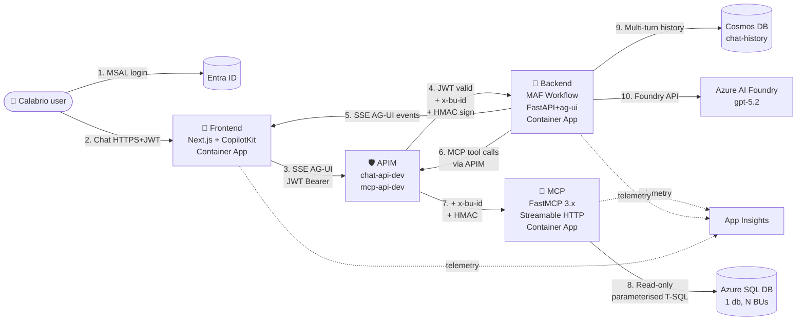
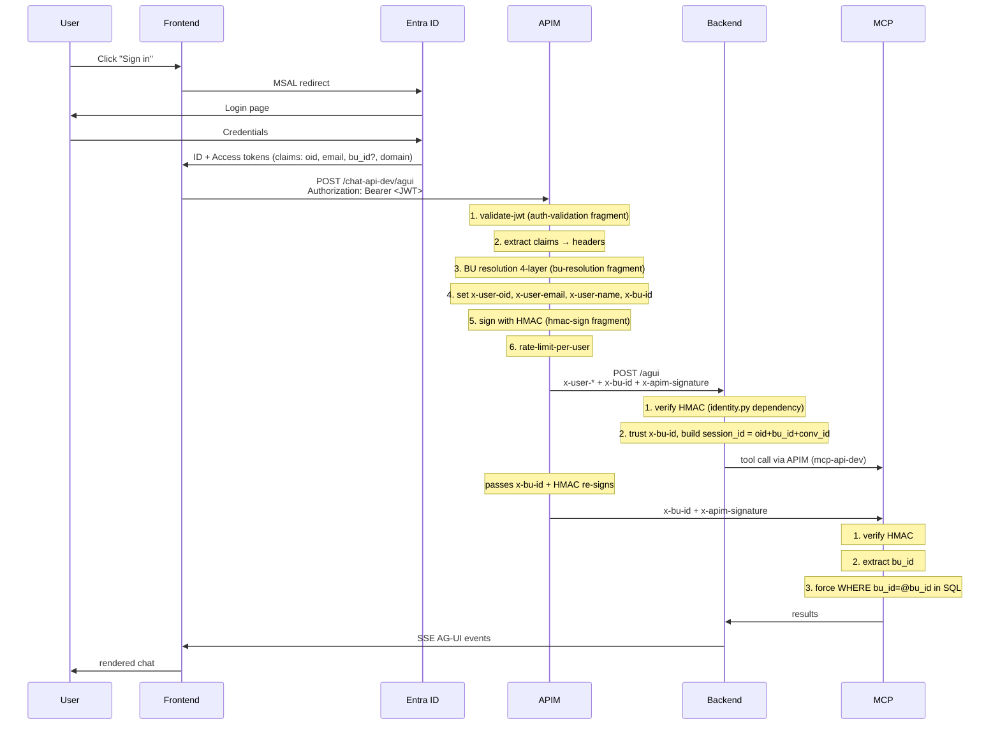

# PLAN — ParalelCalabrioMAF v2

> **Single source of truth** for the project. Every architectural decision lives here.
> If anything in this document conflicts with code, this document wins — and we open an issue.

**Created**: 2026-05-27
**Status**: Phase 0 — Scaffold
**Working base branch**: `develop` (PRs → `main`)

---

## Table of contents

1. [Vision and scope](#1-vision-and-scope)
2. [Global architecture](#2-global-architecture)
3. [Locked architectural decisions](#3-locked-architectural-decisions)
4. [Tech stack](#4-tech-stack)
5. [Monorepo structure](#5-monorepo-structure)
6. [Component detail](#6-component-detail)
7. [Authentication flow and BU resolution](#7-authentication-flow-and-bu-resolution)
8. [MCP design](#8-mcp-design)
9. [Schema strategy (DB ↔ LLM)](#9-schema-strategy-db--llm)
10. [Azure infrastructure](#10-azure-infrastructure)
11. [Testing](#11-testing)
12. [DevOps and branching](#12-devops-and-branching)
13. [Project phases](#13-project-phases)
14. [Environment variables inventory](#14-environment-variables-inventory)
15. [References and legacy artifacts](#15-references-and-legacy-artifacts)

---

## 1. Vision and scope

### Product objective

Conversational assistant that lets Calabrio WFM users ask natural-language questions about their data (shifts, absences, agents, sites, etc.) and receive answers backed by real data from their Business Unit (BU) — without exposing SQL to the user and without leaking data from other BUs.

### v2 scope (this project)

- **3 Azure Container Apps**: backend (MAF orchestration), frontend (Next.js + CopilotKit), MCP (FastMCP).
- **Frontend with Entra ID login** + real-time chat (AG-UI).
- **APIM in front of** backend and MCP with auth, rate limiting, BU resolution, HMAC signing.
- **1 active BU** (`CWFM-DEMO`, BU_ID=1); architecture ready for N BUs.
- **Persistent multi-turn** via Cosmos DB.
- **End-to-end observability** with Azure Monitor + App Insights.

### Out of scope for v2

- Write actions against WFM (read-only only).
- Physical multi-tenancy (single Azure SQL Database, logical segregation by `bu_id`).
- Self-service provisioning of new customers.
- External integrations (Teams, Slack, etc.) — future.

---

## 2. Global architecture



### Design principles

1. **Each service has a single responsibility** (frontend = UI/auth, backend = LLM orchestration, MCP = DB access).
2. **APIM always in front** — nothing is exposed directly.
3. **HMAC between APIM and backend/MCP** — backend and MCP trust only requests signed by APIM (defense in depth in case a Container App endpoint is accidentally exposed).
4. **BU is resolved at APIM**, not in backend. Backend trusts the `x-bu-id` header.
5. **MCP is stateless** — no conversation state.
6. **Multi-turn lives in backend** via `CosmosHistoryProvider` with `session_id` per user+BU+conv.

---

## 3. Locked architectural decisions

| #  | Decision | Rationale |
|----|----------|-----------|
| D1 | Monorepo (apps/backend, apps/frontend, apps/mcp) | Cross-component refactor and atomic review; one PR can change BE↔MCP contract together. |
| D2 | 3 independent Container Apps (not a monolith) | Independent scaling; FE can grow in concurrency without impacting MCP. |
| D3 | Frontend: Next.js 15 + CopilotKit + Tailwind/shadcn/ui + MSAL (`@azure/msal-react`) | CopilotKit + MAF AG-UI = native integration; MSAL redirect flow for Entra ID. |
| D4 | Backend: FastAPI + `agent_framework.ag_ui` (1st party) | Official AG-UI endpoint via `add_agent_framework_fastapi_endpoint`. |
| D5 | MCP: FastMCP ≥3.3.1 + `mount(prefix=...)` for namespacing | Stateless Streamable HTTP; namespaces (`schema.*`, `query.*`, future `forecast.*`) with no collisions. |
| D6 | APIM with multi-API per environment (`chat-api-dev`, `chat-api-prod`, `mcp-api-dev`, `mcp-api-prod`) | Strict dev/prod isolation; policies versioned in repo as fragments. |
| D7 | Reusable Policy Fragments (`auth-validation`, `bu-resolution`, `hmac-sign`, `rate-limit-per-user`) | DRY across APIs; one place to change auth/BU logic. |
| D8 | BU resolution 4-layer at APIM: (1) JWT claim → (2) domain map (Named Value) → (3) `x-debug-bu` POC header → (4) `BU_ID_DEFAULT` fallback | Works day 1 without claims configured; supports multi-BU with no code changes. |
| D9 | Schema introspection: INFORMATION_SCHEMA + `sys.extended_properties` (MS_Description) — **no aliases** | Single source of truth inside SQL; partner approves `sp_addextendedproperty`; LLM reads from MCP at runtime. |
| D10 | Simplified Intent: kill `candidate_tables` — Intent only classifies (DataQuery / Conversational / OutOfScope); SqlBuilder explores schema on its own (via MCP) | Reduces coupling and tokens; each step does one thing. |

---

## 4. Tech stack

### Backend (`apps/backend`)
- Python 3.11
- `agent-framework==1.6.0` (meta) — uses `agent_framework`, `agent_framework.ag_ui`, `agent_framework.foundry`, `agent_framework.azure`
- FastAPI + Uvicorn
- `azure-cosmos`, `azure-identity`, `azure-monitor-opentelemetry`
- `mcp` (client, via MAF's `MCPStreamableHTTPTool`)
- pytest, pytest-asyncio, httpx

### Frontend (`apps/frontend`)
- Node 20, pnpm
- Next.js 15 (App Router, RSC)
- React 19
- `@copilotkit/react-core`, `@copilotkit/react-ui`, `@copilotkit/runtime`
- `@azure/msal-browser`, `@azure/msal-react`
- Tailwind CSS 4 + shadcn/ui
- Vitest, Playwright

### MCP (`apps/mcp`)
- Python 3.11
- `fastmcp>=3.3.1`
- `pyodbc` or `aioodbc` (SQL Server driver)
- `sqlglot` (AST validation for SELECT-only)
- `azure-identity` (DefaultAzureCredential for Entra-auth SQL)
- `azure-keyvault-secrets` (if SQL auth with password)
- pytest, pytest-asyncio

### Infra (`infra/`)
- Bicep (modules: `containerapps.bicep`, `apim.bicep`, `cosmos.bicep`, `keyvault.bicep`, `acr.bicep`, `loganalytics.bicep`, `appinsights.bicep`, `sql.bicep`, `network.bicep`)
- `azd` (Azure Developer CLI) for deployments
- Shared Container Apps Environment
- APIM developer SKU (Standard v2 if budget allows)

### CI/CD (`.github/workflows/`)
- GitHub Actions
- Per-component workflows: `backend-ci.yml`, `frontend-ci.yml`, `mcp-ci.yml`, `infra-validate.yml`
- E2E workflow: `e2e-tests.yml` (on `develop` branch post-merge)

---

## 5. Monorepo structure

```
ParalelCalabrioMAFTest/
├── PLAN.md                          # ← this document
├── README.md                        # consolidated quickstart, links to docs/
├── .env.example                     # infra vars (azd)
├── .github/
│   ├── ISSUE_TEMPLATE/
│   │   ├── bug_report.md
│   │   ├── feature.md
│   │   ├── docs.md
│   │   ├── infra.md
│   │   ├── security.md
│   │   ├── test.md
│   │   ├── refactor.md
│   │   ├── chore.md
│   │   └── config.yml
│   ├── pull_request_template.md
│   ├── CODEOWNERS
│   └── workflows/
│       ├── backend-ci.yml
│       ├── frontend-ci.yml
│       ├── mcp-ci.yml
│       ├── infra-validate.yml
│       └── e2e-tests.yml
├── apps/
│   ├── backend/
│   │   ├── app/
│   │   │   ├── __init__.py
│   │   │   ├── main.py              # FastAPI app + ag-ui endpoint
│   │   │   ├── workflow.py          # 3-step MAF workflow (Intent→SQLBuilder→QueryExecutor)
│   │   │   ├── identity.py          # FastAPI dependency: parse x-user-* + x-bu-id + verify HMAC
│   │   │   ├── history.py           # CosmosHistoryProvider wrapper
│   │   │   ├── tools.py             # MCPStreamableHTTPTool factory
│   │   │   └── settings.py          # pydantic-settings
│   │   ├── tests/
│   │   ├── pyproject.toml
│   │   ├── Dockerfile
│   │   ├── .env.example
│   │   └── README.md
│   ├── frontend/
│   │   ├── app/                     # Next.js App Router
│   │   │   ├── layout.tsx
│   │   │   ├── page.tsx             # landing/login
│   │   │   ├── chat/page.tsx
│   │   │   └── api/copilotkit/route.ts
│   │   ├── components/
│   │   │   ├── chat/
│   │   │   ├── auth/MsalProvider.tsx
│   │   │   └── ui/                  # shadcn
│   │   ├── lib/
│   │   │   ├── msal-config.ts
│   │   │   └── api-client.ts
│   │   ├── tests/                   # vitest unit
│   │   ├── e2e/                     # playwright
│   │   ├── package.json
│   │   ├── Dockerfile
│   │   ├── .env.local.example
│   │   └── README.md
│   └── mcp/
│       ├── app/
│       │   ├── __init__.py
│       │   ├── server.py            # FastMCP entry + mounts
│       │   ├── schema_tools.py      # schema.list / search / describe / get_distinct_values
│       │   ├── query_tools.py       # query.execute (read-only)
│       │   ├── sql_client.py        # SqlDatabaseClient
│       │   ├── validator.py         # sqlglot AST validator
│       │   ├── identity.py          # verify HMAC + parse x-bu-id
│       │   └── settings.py
│       ├── scripts/
│       │   ├── bootstrap_metadata.py  # create _metadata schema + tables
│       │   └── seed_extended_properties.py
│       ├── tests/
│       ├── pyproject.toml
│       ├── Dockerfile
│       ├── .env.example
│       └── README.md
├── infra/
│   ├── main.bicep
│   ├── main.parameters.json
│   ├── modules/
│   │   ├── containerapps.bicep
│   │   ├── apim.bicep
│   │   ├── cosmos.bicep
│   │   ├── keyvault.bicep
│   │   ├── acr.bicep
│   │   ├── loganalytics.bicep
│   │   ├── appinsights.bicep
│   │   ├── sql.bicep
│   │   └── network.bicep
│   └── apim-policies/
│       ├── fragments/
│       │   ├── auth-validation.xml
│       │   ├── bu-resolution.xml
│       │   ├── hmac-sign.xml
│       │   └── rate-limit-per-user.xml
│       └── apis/
│           ├── chat-api.xml
│           └── mcp-api.xml
├── database/
│   ├── 01-schemas-and-tables.sql    # inherited, validated
│   ├── 02-views.sql
│   ├── 03-seed-data.sql              # 1 BU CWFM-DEMO / 3 sites / 50 agents
│   ├── 04-grant-readonly.sql
│   ├── 05-metadata-schema.sql        # NEW: _metadata.* tables
│   └── 06-extended-properties.sql    # NEW: sp_addextendedproperty
├── docs/
│   ├── architecture.md               # diagrams + ADR index
│   ├── devops-setup.md               # branch protection + onboarding
│   ├── apim-policies.md
│   ├── mcp-tool-catalog.md           # auto-generated
│   ├── bu-resolution.md
│   ├── security-model.md             # HMAC, JWT, threat model
│   ├── deployment.md                 # azd up step-by-step
│   ├── troubleshooting.md
│   └── adr/
│       ├── ADR-0001-overall-architecture.md
│       ├── ADR-0002-schema-extended-properties.md
│       ├── ADR-0003-bu-resolution-at-apim.md
│       ├── ADR-0004-mcp-namespacing-fastmcp.md
│       ├── ADR-0005-hmac-apim-backend.md
│       └── ADR-0006-cosmos-service-identity-limitation.md
├── tests-e2e/                        # Playwright cross-component
│   ├── playwright.config.ts
│   ├── tests/
│   │   ├── chat-happy-path.spec.ts
│   │   ├── auth-flow.spec.ts
│   │   └── bu-isolation.spec.ts
│   └── package.json
```

---

## 6. Component detail

### 6.1 Backend (`apps/backend`)

**Responsibilities**:
- Serve the AG-UI endpoint (`/agui`) compatible with CopilotKit / AG-UI client.
- Orchestrate the 3-step workflow: `IntentStep` → `SqlBuilderStep` → `QueryExecutorStep`.
- Keep persistent multi-turn state via `CosmosHistoryProvider`.
- Call MCP (via APIM) for schema discovery + query execution.
- Emit telemetry.

**Does NOT**:
- Handle auth (APIM does).
- Resolve BU (APIM does, passed via header).
- Connect directly to SQL (MCP does).

**Main endpoint**:
```
POST /agui  (SSE)
Required headers:
  x-user-oid, x-user-email, x-user-name, x-bu-id
  x-apim-signature (HMAC verifiable)
Body: AG-UI standard
```

**Workflow shape** (inherited from [main_local_multiturn.py](main_local_multiturn.py )):
```python
WorkflowBuilder()
  .set_start_executor(IntentStep)
  .add_edge(IntentStep, SqlBuilderStep, condition=is_data_query)
  .add_edge(IntentStep, RespondDirectly, condition=is_conversational)
  .add_edge(IntentStep, OutOfScope, condition=is_out_of_scope)
  .add_edge(SqlBuilderStep, QueryExecutorStep)
  .add_edge(QueryExecutorStep, FinalResponder)
  .build()
```

### 6.2 Frontend (`apps/frontend`)

**Responsibilities**:
- MSAL login (redirect flow, configurable to popup).
- Chat UI via CopilotKit consuming the backend's AG-UI endpoint (via APIM).
- Show user's active BU (header).
- In POC mode, a visual BU selector (sets the `x-debug-bu` header).

**Does NOT**:
- Own chat logic (it's a pure CopilotKit view).
- Call SQL/MCP (everything goes through backend).

**Minimum pages**:
- `/` — landing with a "Sign in with Microsoft" button
- `/chat` — main UI (post-login)
- `/auth/callback` — MSAL redirect target

### 6.3 MCP (`apps/mcp`)

**Responsibilities**:
- Expose schema-introspection and query-execution tools over Streamable HTTP.
- Enforce `WHERE bu_id = @bu_id` on every query.
- Validate the AST (read-only, no DDL/DML).
- Verify the HMAC from APIM.

**Does NOT**:
- Handle user auth (APIM does, upstream).
- Cache across requests (stateless).

**Day-1 tools (5)**:
| Namespace | Tool | Description |
|-----------|------|-------------|
| `schema` | `list_tables` | Lists tables/views visible to this BU (filtered by `_metadata.agent_allowlist`). |
| `schema` | `search_tables` | Full-text search across names + descriptions. |
| `schema` | `describe_table` | Returns columns, types, descriptions (extended properties), keys, examples. |
| `schema` | `get_distinct_values` | For small categorical columns — returns unique values. |
| `query` | `execute` | Runs a validated SELECT with `bu_id` injected, returns rows + metadata. |

---

## 7. Authentication flow and BU resolution

### End-to-end flow



### BU resolution 4-layer (at APIM, fragment `bu-resolution.xml`)

```
1. JWT claim `extension_bu_id` → if present, use it
2. Domain map (Named Value `domain-to-bu-map` JSON) → email domain → bu_id
3. Header `x-debug-bu` (dev only, gated by an extra API key) → POC without claims
4. Default `BU_ID_DEFAULT` Named Value → final fallback
```

Outcome: `x-bu-id` header is always present when the request reaches backend/MCP.

---

## 8. MCP design

### Namespacing with `mount(prefix=...)`

```python
# apps/mcp/app/server.py
from fastmcp import FastMCP
from .schema_tools import schema_app
from .query_tools import query_app

app = FastMCP("calabrio-mcp")
app.mount(schema_app, prefix="schema")
app.mount(query_app, prefix="query")
# Day 2: app.mount(forecast_app, prefix="forecast")
# Day 2: app.mount(analytics_app, prefix="analytics")
```

Tools end up exposed as `schema.list_tables`, `query.execute`, etc.

### Query validation (read-only enforcement)

```python
# apps/mcp/app/validator.py
import sqlglot
from sqlglot import exp

ALLOWED = {exp.Select, exp.With, exp.Subquery, exp.Union, exp.Intersect, exp.Except}
FORBIDDEN = {exp.Insert, exp.Update, exp.Delete, exp.Drop, exp.Create, exp.Alter, exp.TruncateTable}

def validate_select_only(sql: str) -> None:
    parsed = sqlglot.parse(sql, dialect="tsql")
    for stmt in parsed:
        for node in stmt.walk():
            if isinstance(node, tuple(FORBIDDEN)):
                raise ValueError(f"Forbidden statement: {type(node).__name__}")
        if not isinstance(stmt, tuple(ALLOWED)):
            raise ValueError(f"Top-level must be SELECT/WITH, got {type(stmt).__name__}")
```

### Forcing `bu_id`

`query.execute` always injects `WHERE bu_id = @bu_id` (or adds it if missing), using query parameters (never concatenation). If the original query already has `bu_id`, the value is validated to match.

---

## 9. Schema strategy (DB ↔ LLM)

**Approach C — INFORMATION_SCHEMA + `sys.extended_properties`**

### Why

- Single source of truth inside SQL (no YAML files drifting out of sync).
- Standard T-SQL (`sp_addextendedproperty`), partner approves.
- Allows per-table and per-column descriptions (`MS_Description`).

### `_metadata.agent_allowlist` table

```sql
CREATE TABLE _metadata.agent_allowlist (
    schema_name SYSNAME NOT NULL,
    table_name  SYSNAME NOT NULL,
    is_visible  BIT NOT NULL DEFAULT 1,
    PRIMARY KEY (schema_name, table_name)
);
```

Controls which tables/views the LLM sees. **If not in the allowlist → invisible**.

### `_metadata.tool_audit`

```sql
CREATE TABLE _metadata.tool_audit (
    id BIGINT IDENTITY PRIMARY KEY,
    ts DATETIME2 NOT NULL DEFAULT SYSUTCDATETIME(),
    bu_id INT NOT NULL,
    user_oid NVARCHAR(64),
    tool_name NVARCHAR(100),
    sql_text NVARCHAR(MAX),
    row_count INT,
    duration_ms INT,
    success BIT
);
```

### No aliases

Explicit decision D9: **we do not map "friendly" names to real tables**. The LLM sees real names + descriptions. We trust its ability to reason about technical names.

---

## 10. Azure infrastructure

### Resources

| Resource | Type | Name | Notes |
|----------|------|------|-------|
| RG | Resource Group | `rg-Calabriomafpoc` | swedencentral |
| ACA Env | Container Apps Environment | `calabriomafpoc-cae` | Workload profile Consumption + Dedicated (apim VNet integration future) |
| ACR | Container Registry | `calabriomafpocacr` | Premium for future geo-replication |
| APIM | API Management | `calabriomafpoc-apim` | Standard v2; APIs: `chat-api-dev`, `chat-api-prod`, `mcp-api-dev`, `mcp-api-prod` |
| Cosmos | Cosmos DB (Core SQL) | `calabriomafpoc-cosmos` | DB `agent-framework`, container `chat-history` (pk `/session_id`) |
| Foundry | Cognitive Services account + project | `calabriomafpoc-foundry` / `calabriomafpoc-project` | Model `gpt-5.2` |
| App Insights | Monitor | `calabriomafpoc-ai` | Shared connection string |
| LAW | Log Analytics | `calabriomafpoc-law` | Central sink |
| Key Vault | KeyVault | `calabriomafpoc-kv` | HMAC secret, SQL password, future certs |
| SQL | Azure SQL DB | `calabriomafpoc-sqlserver` / `calabriowfm` | Entra-auth preferred |

### Identities

- Each Container App: system-assigned managed identity.
- Backend MI → Cosmos Data Contributor, ACR pull, KV secret reader, App Insights.
- MCP MI → SQL `db_datareader` (custom role limited to allowlist), KV secret reader, App Insights.
- Frontend MI → ACR pull, App Insights.
- APIM MI → KV secret reader (HMAC secret).

---

## 11. Testing

### Pyramid strategy

```
        /\        E2E (tests-e2e/, Playwright)
       /  \       — full flows: login → chat → answer
      /----\
     / Int. \     Per-service integration
    /--------\    — backend: pytest httpx against FastAPI test client
   /          \   — mcp: pytest against FastMCP test client + real SQL (LocalDB or testcontainer)
  /            \  — frontend: Playwright against local build
 /  Unit tests  \
/----------------\ Unit
                  — backend: pytest workflows, identity, history
                  — mcp: validator AST, sql_client
                  — frontend: vitest hooks, msal-config
```

### Minimum coverage

- Unit: ≥ 70% per component.
- Integration: every MCP tool + every backend endpoint.
- E2E: 5 critical scenarios (login OK, chat data query OK, chat conversational OK, BU isolation, error path).

### CI gates

- PR → develop: lint + unit + integration (3 workflows in parallel).
- Post-merge develop: E2E (separate workflow, does not block PRs).
- PR develop → main: full re-run + manual approval.

---

## 12. DevOps and branching

### Chosen model: **GitFlow-lite**

```
main          ●─────────●─────────●        (production, protected)
              ↑          ↑          ↑
develop       ●──●──●──●──●──●──●──●     (integration, protected)
                 ↑  ↑     ↑     ↑
feature/*       ●──●     ●     ●          (short-lived, deleted on merge)
```

### Rules

1. `main` = production code. Receives PRs only from `develop`.
2. `develop` = continuous integration. Receives PRs only from `feature/*` or `fix/*`.
3. **Feature branches** are born from `develop` and die in `develop` via PR.
4. Naming:
   - `feature/<phase>-<short-desc>` (e.g. `feature/phase-1-backend-scaffold`)
   - `fix/<issue-id>-<short-desc>`
   - `docs/<topic>`
   - `chore/<topic>`
   - `hotfix/<issue-id>` (exception — direct to `main` with backport to `develop`)
5. Commits: conventional (`feat:`, `fix:`, `docs:`, `chore:`, `refactor:`, `test:`).
6. Squashed merge into `develop`; merge commit into `main` (preserves linear release history).

### Branch protection (manual UI setup, see `docs/devops-setup.md`)

**`main`**:
- ✅ Require PR before merging
- ✅ Require approvals (min 1, or 0 if solo project)
- ✅ Require status checks to pass before merging
  - `backend-ci`, `frontend-ci`, `mcp-ci`, `infra-validate`
- ✅ Require conversation resolution
- ✅ Require linear history
- ❌ No force pushes, no deletions

**`develop`**:
- ✅ Require PR before merging
- ❌ Require approvals (optional — for learning, 0 self-approval is fine)
- ✅ Require status checks (same as main)
- ❌ No force pushes
- Allow deletions: OFF — `develop` is never deleted

### Why GitFlow-lite and not the alternatives

| Alternative | Why discarded |
|-------------|--------------|
| GitHub Flow (only `main` + features) | No integration gate before production; fine for small SaaS, but loses practice with merge-trains for DevOps learning. |
| Trunk-Based with feature flags | Requires feature-flag discipline from day 1; over-engineering for v2. |
| Full GitFlow (release/* + hotfix/*) | Too much ceremony for 1 dev; release branches add no value without multiple supported versions in parallel. |

GitFlow-lite gives us:
- Practice with PRs, code review, branch protection (DevOps goals).
- An intermediate gate (`develop`) so `main` doesn't break.
- A clear hotfix path if production breaks.
- Readable and teachable naming.

---

## 13. Project phases

### Phase 0 — Scaffold (right now)
- [x] Remove CalabrioMAFVersion
- [x] Remove OLD/ archive (lesson preserved in ADR-0006)
- [x] Create PLAN.md
- [x] Create directory skeleton `apps/`, `infra/`, `docs/`, `tests-e2e/`
- [x] Per-component README stubs
- [x] ADR-0001
- [x] `.github/` templates + workflow placeholders
- [ ] Labels + initial issues
- [ ] Set up `develop` branch + protection

### Phase 1 — Backend
Refactor [main_local_multiturn.py](main_local_multiturn.py ) into `apps/backend/`:
- Modularize workflow, history provider, mcp tool factory
- FastAPI + `add_agent_framework_fastapi_endpoint`
- Identity dependency (parse headers + verify HMAC)
- Drop `candidate_tables` from IntentStep (decision D10)
- Settings via pydantic-settings
- pytest + httpx tests
- Multi-stage Dockerfile
- backend README

### Phase 2 — MCP
Greenfield MCP server:
- FastMCP server with `mount(prefix=...)`
- `SqlDatabaseClient` (Entra-auth + KV fallback)
- 5 tools (`schema.list/search/describe/get_distinct_values`, `query.execute`)
- `sqlglot` validator
- Bootstrap scripts for `_metadata` + seed `extended_properties`
- Drift check (extended props vs INFORMATION_SCHEMA)
- pytest against LocalDB or testcontainer
- Dockerfile
- mcp README + auto-generated tool catalog

### Phase 3 — Frontend
- Next.js 15 scaffold with App Router + Tailwind + shadcn
- MSAL config + provider + protected routes
- Login page + chat page
- CopilotKit + AG-UI client pointing to APIM
- BU selector (POC mode `x-debug-bu`)
- Vitest unit + Playwright e2e
- Dockerfile (Node 20 standalone)
- frontend README

### Phase 4 — APIM
- 4 policy fragments (`auth-validation`, `bu-resolution`, `hmac-sign`, `rate-limit-per-user`)
- APIs `chat-api-dev` + `chat-api-prod` + `mcp-api-dev` + `mcp-api-prod`
- Named values: `BU_ID_DEFAULT`, `domain-to-bu-map`, `hmac-secret` (from KV)
- Backend HMAC verify dependency
- MCP HMAC verify dependency
- Integration tests APIM ↔ backend ↔ MCP

### Phase 5 — Infra (Bicep + azd)
- `main.bicep` + modules
- `azd up` end-to-end (1 command)
- RBAC assignments
- KV secret seeding
- Tested deploy on swedencentral

### Phase 6 — Testing + Docs
- Full Playwright E2E (5 scenarios)
- Per-component CI workflows working
- Docs/: architecture, security-model, deployment, troubleshooting, apim-policies, bu-resolution, mcp-tool-catalog (auto-gen)
- ADR-0002 through ADR-0005

---

## 14. Environment variables inventory

### Backend (`apps/backend/.env.example`)
```
FOUNDRY_PROJECT_ENDPOINT=
FOUNDRY_DEPLOYMENT_NAME=gpt-5.2
AZURE_AI_MODEL_DEPLOYMENT_NAME=gpt-5.2
MCP_SERVER_URL=https://<apim>/mcp-api-dev/mcp/
AZURE_COSMOS_ENDPOINT=
AZURE_COSMOS_DATABASE_NAME=agent-framework
AZURE_COSMOS_CONTAINER_NAME=chat-history
APPLICATIONINSIGHTS_CONNECTION_STRING=
ENABLE_INSTRUMENTATION=true
ENABLE_SENSITIVE_DATA=true
OTEL_SERVICE_NAME=wfm-backend
BU_ID_DEFAULT=1
HMAC_SHARED_SECRET=                          # from KV ref in prod
LOG_LEVEL=INFO
```

### MCP (`apps/mcp/.env.example`)
```
AZURE_SQL_SERVER=calabriomafpoc-sql.database.windows.net
AZURE_SQL_DATABASE=calabriowfm
SQL_AUTH_MODE=entra
SQL_USERNAME=
KEYVAULT_URI=https://calabriomafpoc-kv.vault.azure.net/
HMAC_SHARED_SECRET=
APPLICATIONINSIGHTS_CONNECTION_STRING=
OTEL_SERVICE_NAME=wfm-mcp
LOG_LEVEL=INFO
```

### Frontend (`apps/frontend/.env.local.example`)
```
NEXT_PUBLIC_APIM_BASE_URL=https://calabriomafpoc-apim.azure-api.net
NEXT_PUBLIC_MSAL_CLIENT_ID=9dfbf018-d41b-4579-8b6c-e58d1a9a52be
NEXT_PUBLIC_MSAL_TENANT_ID=562029ef-9022-45a6-b255-40cd71ebb2ce
NEXT_PUBLIC_MSAL_REDIRECT_URI=http://localhost:3000/auth/callback
NEXT_PUBLIC_API_SCOPE=api://<backend-app-id>/access_as_user
NEXT_PUBLIC_AGUI_PATH=/chat-api-dev/agui
```

### Infra/azd (root `.env.example`)
```
AZURE_SUBSCRIPTION_ID=0acbc8a1-0f3e-498e-b86b-6fa5468730e2
AZURE_TENANT_ID=562029ef-9022-45a6-b255-40cd71ebb2ce
AZURE_LOCATION=swedencentral
AZURE_RESOURCE_GROUP=rg-Calabriomafpoc
AZURE_ENV_NAME=calabriomafpoc
AZURE_CONTAINER_REGISTRY_ENDPOINT=calabriomafpocacr.azurecr.io
```

### Discarded variables (legacy)
`USER_QUESTION`, `INTENT_AGENT_NAME`, `SQL_BUILDER_AGENT_NAME`, `QUERY_EXECUTOR_AGENT_NAME`,
`AGENT_WFM_*`, `ENABLE_HOSTED_AGENTS`, `ENABLE_CAPABILITY_HOST`, `FOUNDRY_AGENT_NAME`,
`AGENT_SERVER_HOSTED`, `FOUNDRY_MODEL`, `BU_ID` (hardcoded).

---

## 15. References and legacy artifacts

### v1 codebase (removed from repo, archived by the maintainer)

The previous iteration lived under `OLD/` and contained:

- `main_local.py` — single-shot local CLI (predecessor).
- `main_local_multiturn.py` — multi-turn local CLI; its design is the
  starting point for `apps/backend` (kept at the repo root as
  `main_local.py` until Phase 1 lands).
- `foundry_hosted/` — Foundry Hosted Agent variant. Discarded as the runtime
  host for the backend (see ADR-0006).
- `update_agents.py` — publish/update Foundry Prompt Agents. Discarded.
- `scripts/` — deploy utilities. Reference only, do not port as-is.
- `README-v1-archived.md` — long-form v1 README. The key engineering lesson
  (Cosmos DB data-plane RBAC vs `ServiceIdentity`) is preserved in
  [ADR-0006](docs/adr/ADR-0006-cosmos-service-identity-limitation.md).

### `CalabrioMAFVersion/` (removed from repo, archived elsewhere)
Contained:
- `src/apim/policies/chat-api.xml` — base for Phase 4 (rewrite as fragments).
- `src/mcp_wfm/app/tools.py` — `SqlDatabaseClient` + sqlglot validation (port to `apps/mcp/`).
- `src/frontend/` (Angular) — UX patterns only, do NOT port code (we changed stack to Next.js).
- `database/*.sql` — extracted to `database/` in this repo during Phase 0.

### External technical references

- [Microsoft Agent Framework docs](https://github.com/microsoft/agent-framework)
- [`agent_framework.ag_ui` module](https://github.com/microsoft/agent-framework/tree/main/python/packages/ag_ui)
- [FastMCP 3.x](https://gofastmcp.com/)
- [CopilotKit](https://docs.copilotkit.ai/)
- [MSAL React](https://github.com/AzureAD/microsoft-authentication-library-for-js/tree/dev/lib/msal-react)
- [APIM Policy reference](https://learn.microsoft.com/en-us/azure/api-management/api-management-policies)

---

**Last updated**: 2026-05-27
**Next milestone**: Phase 0 scaffold + `develop` setup + branch protection
