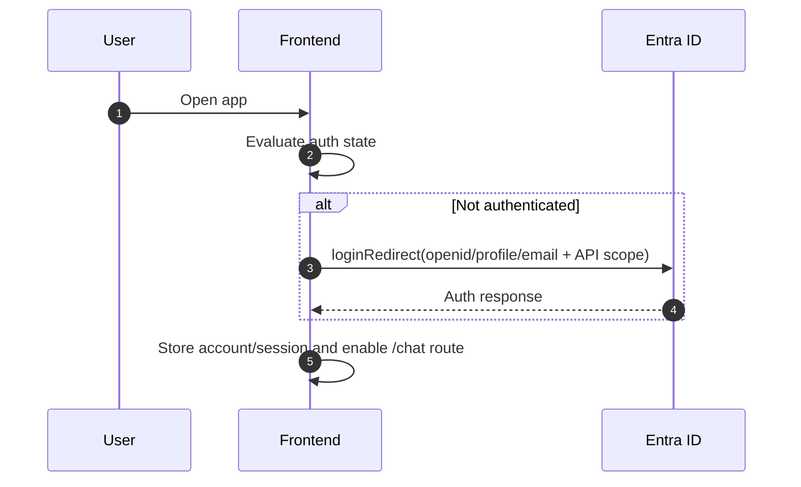
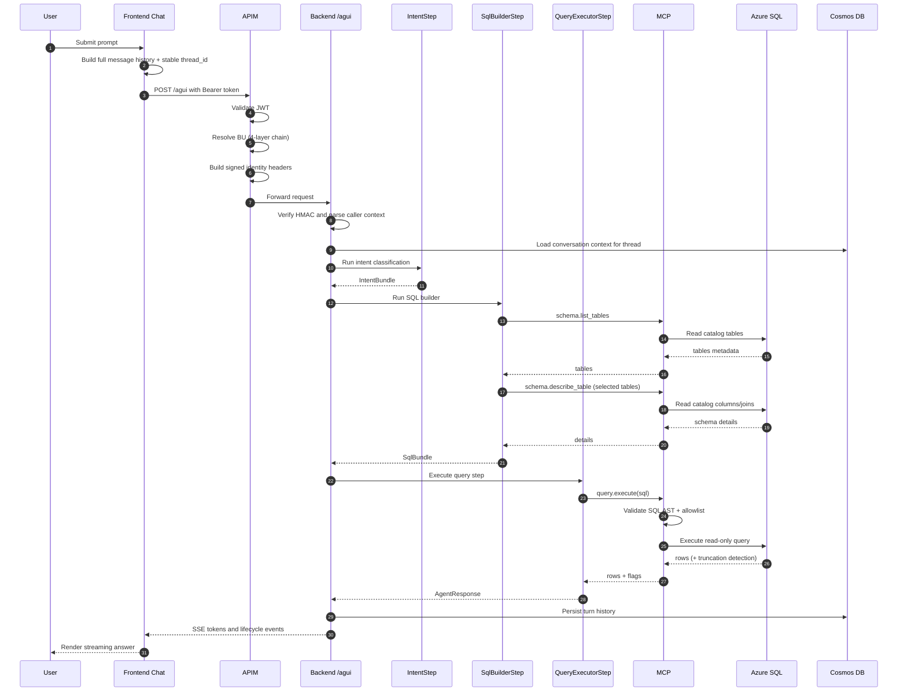
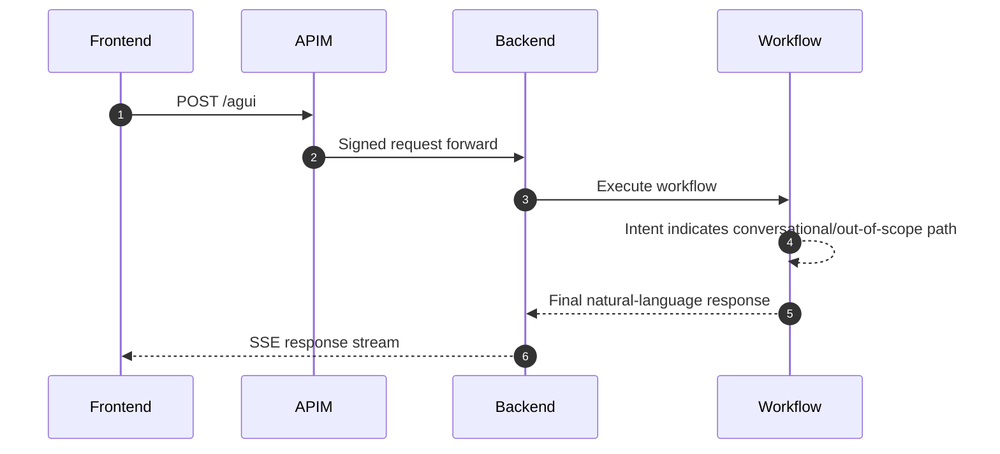
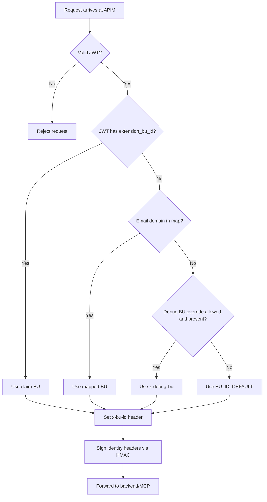
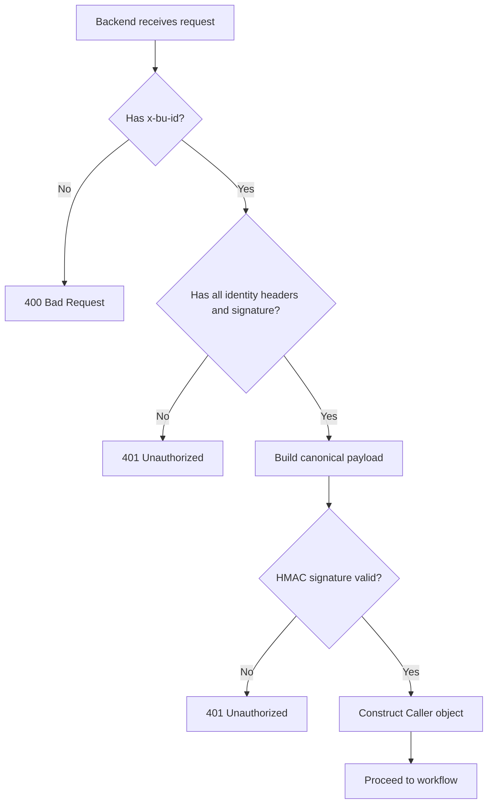
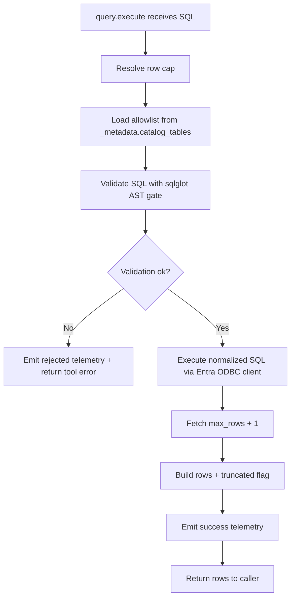
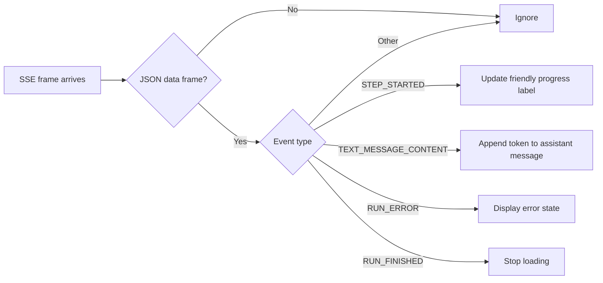

# Agent and Service Flows - Detailed Runtime Sequences

## 1. Purpose

This document provides sequence-level detail for how requests move through the system at runtime. It is intended for:

- Debugging and incident response.
- Presentation material that needs concrete flow diagrams.
- Implementation checks to avoid architecture drift.

The flows reflect current implementation and near-term design intent from `PLAN.md` and ADRs.

## 2. Main Runtime Actors

- Browser user session.
- Frontend (Next.js + MSAL + AG-UI client).
- APIM (JWT validation, BU resolution, HMAC signing).
- Backend (FastAPI + AG-UI endpoint + MAF workflow).
- MCP (FastMCP `schema.*` and `query.*` tools).
- Azure SQL.
- Cosmos DB.
- Foundry model endpoint.

## 3. Authentication and Session Bootstrap Flow

Important notes:

- Frontend uses MSAL redirect flow.
- Access token retrieval is attempted silently first for API requests.
- On silent acquisition failure, frontend triggers redirect-based token acquisition.

## 4. Chat Request Lifecycle (Data Query)

## 5. Chat Request Lifecycle (Conversational / Out-of-Scope)

In this path, SQL execution may be skipped or replaced by a safe fallback response depending on plan validity.

## 6. APIM BU Resolution Decision Flow

## 7. Backend Identity Verification Flow

## 8. SQL Validation and Execution Flow in MCP

## 9. Frontend SSE Event Handling Flow

## 10. AG-UI Event Mapping Used by UI

| Event type | UI behavior |
|---|---|
| `STEP_STARTED` | updates progress state shown in bubble |
| `TEXT_MESSAGE_CONTENT` | appends streaming token text |
| `RUN_ERROR` | shows recoverable user-visible error |
| `RUN_FINISHED` | marks completion and unlocks input |

## 11. Failure Scenarios and Observable Symptoms

### 11.1 Token acquisition failure

- Symptom: frontend cannot call backend.
- Surface: user-visible auth error or redirect.
- Likely root causes: expired session, missing scope, Entra app misconfiguration.

### 11.2 HMAC mismatch

- Symptom: backend returns 401.
- Surface: AG-UI call fails before workflow execution.
- Likely root causes: APIM signing drift, shared secret mismatch, missing headers.

### 11.3 SQL validation rejection

- Symptom: query tool error, assistant may return fallback guidance.
- Surface: MCP rejection telemetry (`outcome=rejected`).
- Likely root causes: forbidden SQL node, unknown table, malformed statement.

### 11.4 Truncated query results

- Symptom: answer based on capped result set.
- Surface: MCP returns `truncated=true`.
- Likely root causes: broad query with insufficient filtering.

## 12. Throughput and Scalability Considerations

- Frontend scales by concurrent users and SSE connection load.
- Backend scales by AG-UI request concurrency, model latency, and MCP round trips.
- MCP scales by query volume and SQL latency.
- SQL remains the primary downstream bottleneck for heavy analytical prompts.

## 13. Traceability Matrix (Flow -> Source)

| Flow concern | Primary source |
|---|---|
| Workflow composition | `apps/backend/app/workflow/build.py` |
| Intent/SQL/Query step contracts | `apps/backend/app/workflow/schemas.py` |
| Identity verification | `apps/backend/app/deps/identity.py` |
| MCP namespace mounting | `apps/mcp/app/main.py` |
| SQL validation | `apps/mcp/app/security/sql_validator.py` |
| Frontend AG-UI SSE handling | `apps/frontend/lib/agui/client.ts` |

## 14. Suggested Presentation Usage

Use this document to generate:

1. Sequence animation slides.
2. Security and trust-boundary slides.
3. Error-handling and resilience slides.
4. Runbook-ready troubleshooting trees.
