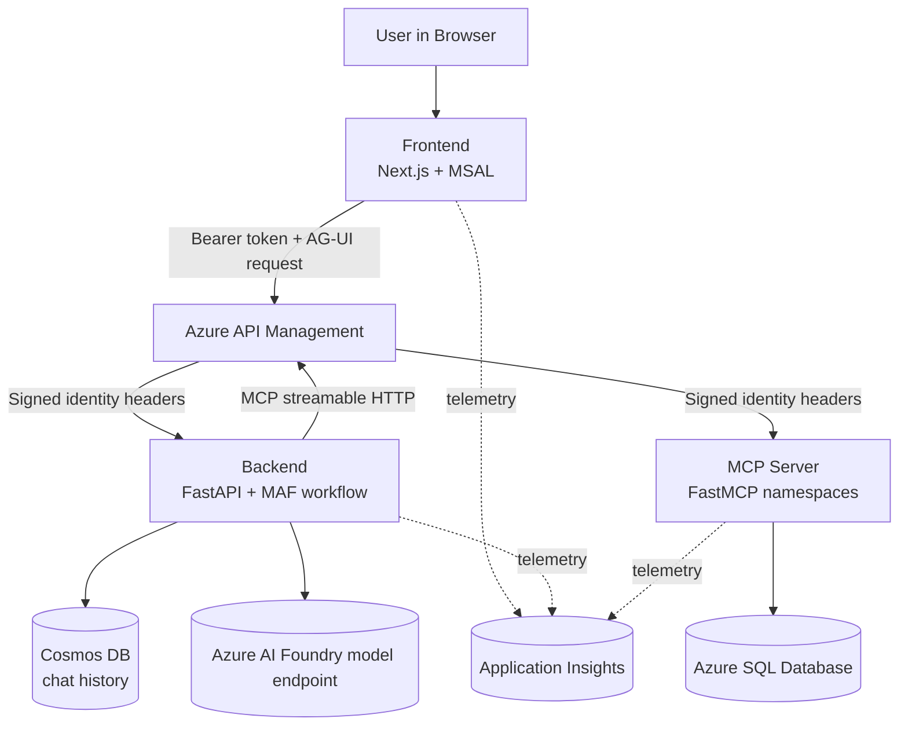
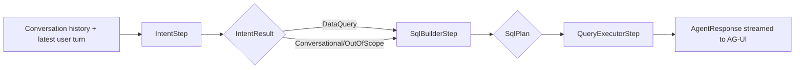
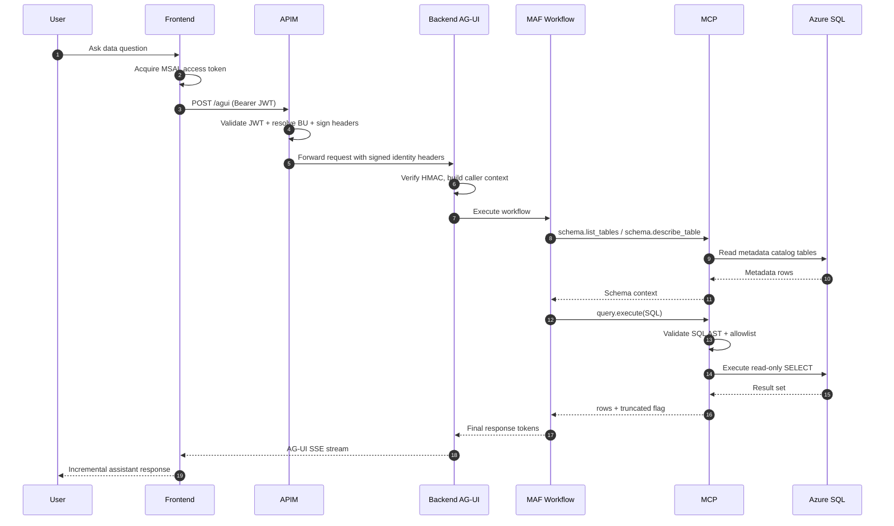
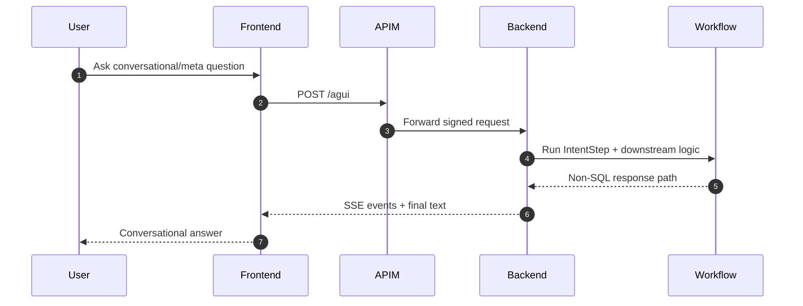
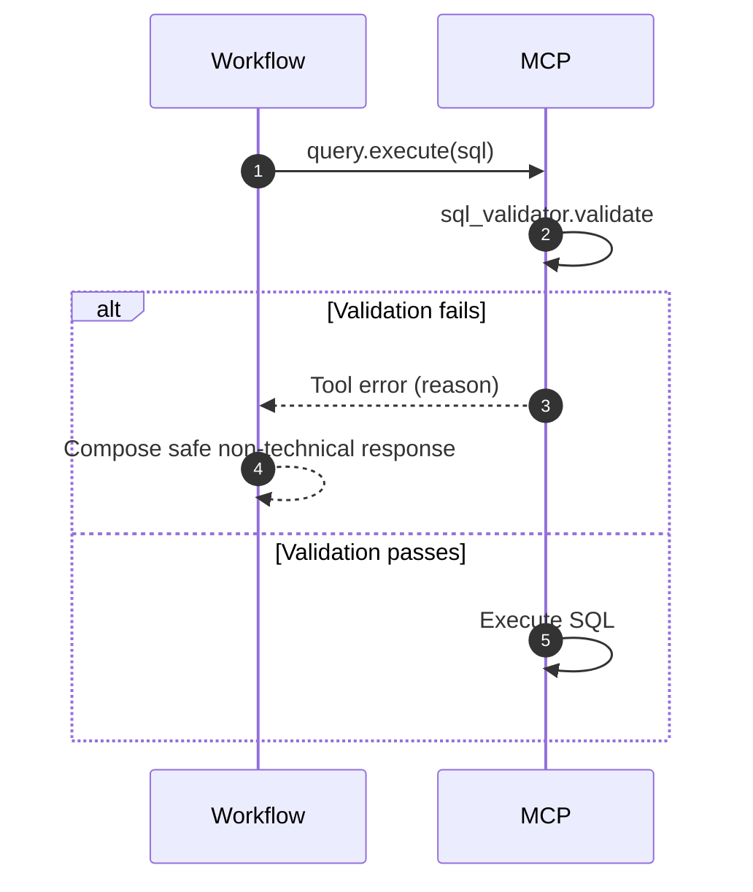
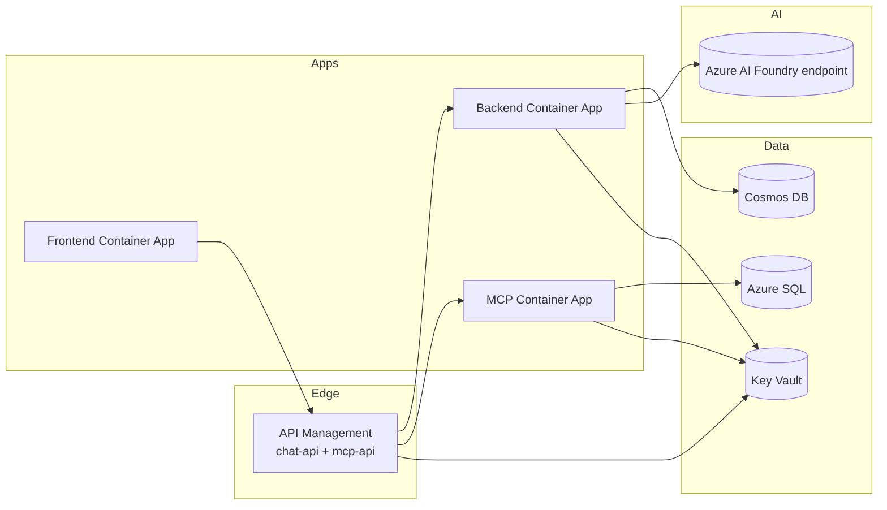

# ParalelCalabrioMAF v2 - Architecture Deep Dive

## 1. Document Purpose

This document is the technical deep dive for the current state of the project and the near-term target architecture. It is designed to support:

- Technical onboarding for engineers (backend, frontend, platform, QA).
- Architecture reviews and threat-model discussions.
- Presentation preparation (executive and technical audiences).
- Implementation planning aligned to `PLAN.md` phases and ADRs.

This document complements (does not replace):

- Root roadmap and decisions: `PLAN.md`
- Architecture decisions: `docs/adr/*`
- Component runbooks: `apps/backend/README.md`, `apps/mcp/README.md`, `apps/frontend/README.md`

## 2. System Summary

ParalelCalabrioMAF v2 is a conversational assistant for Workforce Management (WFM) data with strict Business Unit (BU) isolation. The runtime consists of three services:

1. Frontend (Next.js) for login, chat UX, and SSE rendering.
2. Backend (FastAPI + Microsoft Agent Framework) for orchestration.
3. MCP server (FastMCP) for schema discovery and read-only SQL execution.

The architecture is APIM-fronted and identity-driven. APIM validates JWT, resolves BU, signs identity headers, and forwards to internal services.

## 3. High-Level Logical Architecture

### 3.1 Design Principles

- Single responsibility per service.
- APIM as the policy and trust boundary.
- Stateless MCP, stateful conversation in backend (Cosmos).
- Read-only SQL operations for assistant queries.
- Explicit schema metadata contract via `_metadata.catalog_*`.
- Deterministic security layers (JWT validation, BU resolution, HMAC verification, SQL AST gate, DB grants).

## 4. Component Architecture

### 4.1 Frontend (`apps/frontend`)

Primary responsibilities:

- Entra ID authentication via MSAL.
- Route protection (`/login`, `/chat`).
- Streaming chat rendering from AG-UI SSE endpoint.
- Optional POC BU override header emission (`x-debug-bu`) when enabled.

Key runtime flow:

- Acquire token silently for API scope.
- POST chat payload to backend `/agui` endpoint.
- Parse SSE frames (`data: { ... }`) and map AG-UI events to UI states.

Important implementation notes:

- A stable `thread_id` is generated once per browser chat session and reused to preserve backend multi-turn continuity.
- UI shows live workflow progress mapped from AG-UI `STEP_STARTED` events:
  - `intent_step`
  - `sql_builder_step`
  - `query_executor_step`

### 4.2 Backend (`apps/backend`)

Primary responsibilities:

- Host FastAPI app and AG-UI endpoint.
- Verify APIM-signed identity headers (HMAC).
- Build and execute a 3-step MAF workflow.
- Connect to Foundry model endpoint.
- Persist/retrieve conversation history from Cosmos.

Main runtime pipeline:

1. Lifespan startup initializes telemetry and long-lived resources.
2. Opens Azure credential and MCP tool sessions.
3. Builds workflow with 3 executors.
4. Registers AG-UI endpoint at `/agui`.

Workflow composition:

- `IntentStep` -> classify request and resolve standalone question.
- `SqlBuilderStep` -> discover schema/tools and produce SQL plan.
- `QueryExecutorStep` -> execute query and format final answer.

### 4.3 MCP (`apps/mcp`)

Primary responsibilities:

- Expose namespaced tools for schema and query operations.
- Validate SQL AST (read-only only, allowlist bound).
- Execute parameterized SQL through Entra-authenticated ODBC.
- Enforce row caps, truncation signaling, and structured query telemetry.

Namespace model:

- `schema.*` tools for discovery and introspection.
- `query.execute` for read-only SQL execution.

## 5. Agent Workflow Internal Design

### 5.1 Contracts Between Steps

- `IntentResult`: `intent`, `language_hint`, `cache_action`, `resolved_question`.
- `IntentBundle`: carries resolved and original question + BU id + `IntentResult`.
- `SqlPlan`: `sql`, `tables_used`, `assumptions`, `explanation`, `error`.
- `SqlBundle`: carries `SqlPlan`, target language, resolved question.

### 5.2 Prompt Strategy

- Prompts are explicit and domain-neutral.
- SQL builder is forced to discover schema from MCP tools (no hidden assumptions).
- Query executor is instructed to avoid exposing internals and to recover safely on errors.

## 6. End-to-End Runtime Flows

### 6.1 Data Query Happy Path

### 6.2 Conversational / Non-Data Path

### 6.3 Failure Path (Invalid SQL)

## 7. Identity, Trust, and Security Architecture

### 7.1 Trust Model

- Public trust boundary: Browser to APIM.
- Internal trust boundary: APIM to backend/MCP (signed headers).
- Backend and MCP do not trust caller-supplied identity headers unless HMAC verification passes.

### 7.2 Identity Header Contract

Signed headers include:

- `x-user-oid`
- `x-user-email`
- `x-user-name`
- `x-bu-id`

Canonical payload order and separator are fixed to avoid ambiguity.

### 7.3 BU Resolution Strategy (APIM)

Planned 4-layer fallback chain:

1. JWT claim (`extension_bu_id`).
2. Email-domain mapping.
3. Debug override header (`x-debug-bu`) in controlled contexts.
4. Default BU.

This design centralizes tenant-resolution logic and keeps backend/MCP deterministic.

### 7.4 SQL Safety Layers

Defense in depth:

1. SQL AST validator (SELECT-only and forbidden node rejection).
2. Table allowlist from `_metadata.catalog_tables`.
3. Read-only DB principal grants.
4. Row caps and truncation handling to prevent large payload accidents.

## 8. Data Architecture

### 8.1 Metadata Catalog Pattern

Metadata is first-class relational data in `_metadata` schema:

- `catalog_tables`
- `catalog_columns`
- `catalog_joins`
- `tool_audit`

Benefits:

- Queryable and versionable.
- Directly consumed by MCP schema tools.
- Easier evolution than extended properties for LLM-centric metadata.

### 8.2 Application Data Access Pattern

- MCP executes query plans against Azure SQL.
- Queries are bounded by row caps.
- Results returned as structured rows for downstream language formatting.

### 8.3 Conversation State Pattern

- Backend stores multi-turn history in Cosmos DB.
- Thread continuity driven by frontend-provided stable `thread_id`.
- Stateless frontend and stateless MCP.

## 9. API and Event Contracts

### 9.1 AG-UI Request Shape (frontend -> backend)

Essential payload elements:

- `messages[]`: role + content + stable message ids.
- `thread_id`: stable per conversation session.
- `run_id`: per request execution id.

### 9.2 AG-UI SSE Event Consumption (backend -> frontend)

Frontend reacts to key event types:

- `STEP_STARTED` -> progress indicator update.
- `TEXT_MESSAGE_CONTENT` -> token append.
- `RUN_ERROR` -> error surface.
- `RUN_FINISHED` -> stream completion.

## 10. Deployment Topology (Target Azure)

### 10.1 Runtime Characteristics

- Three independently deployable services.
- APIM policy reuse through fragments.
- Potential independent scaling of frontend, backend, and MCP.

## 11. Observability and Diagnostics

### 11.1 Telemetry Sources

- Frontend UI-level errors and behavior.
- Backend traces and workflow lifecycle.
- MCP query execution telemetry (`sql_hash`, row count, latency, truncated flag).

### 11.2 Operational Signals to Track

- Token acquisition failures (frontend auth issues).
- HMAC verification failures (trust boundary breaches).
- SQL validation rejection rate.
- Query truncation frequency.
- End-to-end latency percentile by intent category.

## 12. Testing and Quality Strategy

### 12.1 Backend

- Strong test coverage around workflow logic, identity, HMAC, lifecycle, settings.

### 12.2 MCP

- Unit tests for settings, SQL client behavior, validation, and tools.
- Discovery and integration tests for namespaced endpoints.

### 12.3 Frontend

- Unit tests for components and auth utility behavior.
- Playwright suite for UI and route-level confidence.

### 12.4 Cross-Component E2E

Planned end-to-end tests validate full path:

- Auth flow.
- Happy path data query.
- BU isolation scenarios.
- Error and fallback behavior.

## 13. Risk Register (Current + Planned)

| Risk | Impact | Mitigation |
|---|---|---|
| APIM policy drift between dev/prod | Security and behavior mismatch | Fragment reuse + policy-as-code + CI checks |
| Incomplete metadata catalog | Poor SQL generation quality | Drift checker + mandatory schema discovery tools |
| Overly permissive SQL allowances | Data exposure and mutations | AST deny list + read-only DB grants + allowlist |
| Token/identity config drift | Login/API failures | Fail-fast env validation + standardized env inventory |
| BU override misuse | Tenant leakage risk | Restrict debug layer by environment/API and audit usage |

## 14. ADR Index and What Each One Protects

- ADR-0001: Core service decomposition and platform direction.
- ADR-0002: Metadata strategy (`_metadata.catalog_*` tables).
- ADR-0003: BU resolution ownership at APIM.
- ADR-0004: MCP namespacing and extensibility model.
- ADR-0005: HMAC trust boundary for APIM-to-internal hops.
- ADR-0006: Cosmos + ServiceIdentity limitation and architecture consequence.

## 15. Phase-Aligned Delivery Map

- Phase 0: scaffold and architecture baseline.
- Phase 1: backend workflow and AG-UI runtime completed.
- Phase 2: MCP schema/query stack and SQL validator completed.
- Phase 3: frontend auth + chat experience active.
- Phase 4: APIM advanced policy composition and hardening.
- Phase 5: infra IaC and deployment automation maturity.
- Phase 6: full e2e integration hardening and release readiness.

## 16. Presentation-Ready Storyline

A practical sequence for slide generation:

1. Problem statement: secure conversational access to WFM data with BU isolation.
2. Architecture overview: 3 services + APIM + SQL/Cosmos + Foundry.
3. End-to-end flow animation: user query to SQL answer.
4. Agent workflow internals: Intent -> SQL Builder -> Query Executor.
5. Security model: JWT at edge, HMAC internally, SQL safety gates.
6. Data model strategy: metadata catalog as LLM contract.
7. Operational readiness: telemetry, testing, risk mitigations.
8. Roadmap and implementation status by phase.

## 17. Glossary

- AG-UI: Agent UI protocol/event model used for streaming interaction.
- MAF: Microsoft Agent Framework.
- MCP: Model Context Protocol server exposing tools.
- BU: Business Unit tenant boundary for data isolation.
- APIM: Azure API Management.
- SSE: Server-Sent Events.
- UAMI: User-assigned managed identity.

## 18. Source of Truth and Maintenance Rules

When implementation changes, update this file if any of the following are affected:

- Service boundaries or responsibilities.
- Security/trust contracts.
- Workflow step design or event contracts.
- Deployment topology.
- Testing and operational assumptions.

If a decision-level change is made, add/update an ADR and then reflect it here.
